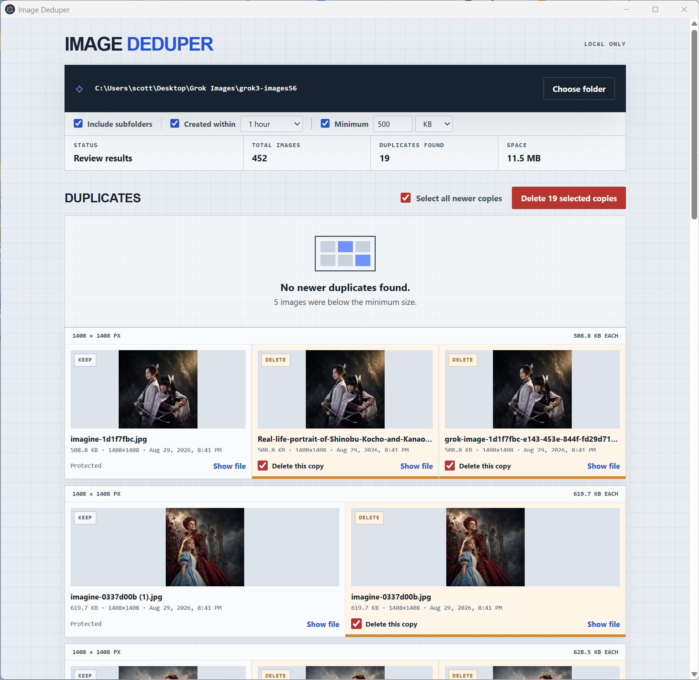

# Image Deduper

Image Deduper quickly groups image files that share the exact same byte size and
pixel dimensions. Review them side by side, choose whether to keep the oldest or
newest, and delete only the copies you select. Everything runs locally; images
are never uploaded.

> **Important: this is not an exact pixel or image-content comparison—and it is
> not intended to be.** Image Deduper is lightweight and fast because its only
> matching signals are exact file size and pixel dimensions. A match is a
> candidate for your review, not proof that two images are visually identical.
> Always review the previews before deleting files.

**[Try Image Deduper in your browser](https://designforever.com/apps/image-deduper)** — no installation or upload required. The web version uses browser-provided modified dates; use the desktop app or Node CLI when creation-time metadata matters.



*Review matching images side by side and choose exactly which newer copies to delete.*

## Why Image Deduper?

Many duplicate-photo tools are built around perceptual similarity scores or
large, multi-purpose disk-cleaning suites. Image Deduper intentionally solves a
narrower problem: reviewing copy-like image files with a matching size and
dimensions, then deciding which version should survive.

- **A lightweight matching rule you can understand.** Groups use only exact byte
  size and pixel dimensions—not pixels, hashes, computer vision, or an
  unexplained similarity percentage.
- **Keep the age you actually want.** Switch between **Delete newer** and
  **Delete older**; the app immediately relabels and reselects each group.
- **Creation-time windows.** Limit matches to files created within 1–12 hours of
  one another, useful for download batches, exports, and generated-image runs.
- **Visual review by default.** Every group is shown side by side before any
  destructive action, with individual files easy to spare.
- **Designed not to erase the whole group.** The interface protects one image,
  and the main process independently refuses a request that would delete every
  file in a group.
- **Files are rechecked before deletion.** If size, dimensions, or creation time
  changed after scanning, deletion is refused.
- **Stop without losing progress.** Cancel a long scan and review the partial
  results already found.
- **Local and inspectable.** No uploads, accounts, telemetry, or hidden cloud
  processing. The source is available under the MIT license.

### When another tool may be better

Image Deduper does not compare pixels or image content. It does not prove that
two images are identical, and it does not look for resized, recompressed,
cropped, rotated, or merely similar-looking photos. A content-hash or
perceptual-similarity tool is a better fit for those jobs. This app is for fast,
understandable candidate grouping followed by human review.

## Download

Download the newest version from the
**[GitHub Releases page](https://github.com/designlook/image-deduper/releases/latest)**.

| Platform | Download |
| --- | --- |
| Windows 10/11, x64 | [Windows installer](https://github.com/designlook/image-deduper/releases/latest/download/ImageDeduper-Windows-x64-Setup.exe) |
| macOS, Apple Silicon | [Apple Silicon ZIP](https://github.com/designlook/image-deduper/releases/latest/download/ImageDeduper-macOS-arm64.zip) |
| macOS, Intel | [Intel Mac ZIP](https://github.com/designlook/image-deduper/releases/latest/download/ImageDeduper-macOS-x64.zip) |
| Node.js 22+ | [CLI package](https://github.com/designlook/image-deduper/releases/latest/download/ImageDeduper-Node-CLI.tgz) |

Checksums are published with every release in `SHA256SUMS.txt`.

## Choose your version

All desktop downloads contain the runtime they need. **Users do not need to
install Node.js, npm, Electron, or a browser.**

| Version | Use it when | What is included | What you need |
| --- | --- | --- | --- |
| Windows x64 installer | You have a typical 64-bit Windows 10 or 11 PC | Image Deduper, Electron, Chromium, and Node.js runtime | Windows 10/11 on an Intel or AMD 64-bit processor |
| macOS Apple Silicon (`arm64`) | About This Mac shows an Apple M-series chip | Image Deduper, Electron, Chromium, and the ARM64 Node.js runtime | An M1-or-newer Mac and the one-time unsigned-app approval described below |
| macOS Intel (`x64`) | About This Mac shows an Intel processor | Image Deduper, Electron, Chromium, and the Intel Node.js runtime | An Intel Mac and the one-time unsigned-app approval described below |
| Node.js CLI | You prefer a terminal, script, or JSON output | The same local scanner with preview-first deletion controls | Node.js 22+; no npm dependencies are required |
| Source code | You want to inspect, modify, or build the app yourself | JavaScript, HTML, CSS, scanner, CLI, packaging configuration, and release workflow | Git, Node.js 22+, and npm; macOS packages must be built on macOS |

The desktop versions have the same interface and scanning features. The only
difference is the operating system and processor architecture they are built
for.

### Node.js command-line version

The CLI uses the same local scanner as the desktop app. With Node.js 22 or
newer, install the latest GitHub release globally:

```bash
npm install --global https://github.com/designlook/image-deduper/releases/latest/download/ImageDeduper-Node-CLI.tgz
image-deduper --help
```

Or download or clone this repository and run the source directly:

```bash
node cli.mjs
node cli.mjs "/path/to/images"
node cli.mjs --help
```

A normal run is a preview and never changes files. To delete the listed copies,
add `--delete`; the CLI asks for confirmation. Use `--delete --yes` only for an
unattended script where permanent deletion is intentional.

```bash
# Scan one folder without its subfolders
node cli.mjs ./images --no-recursive

# Match files created within two hours and at least 500 KB
node cli.mjs ./images --within 2 --min-size 500KB

# Keep the newest file in each group instead of the oldest
node cli.mjs ./images --keep newest

# Machine-readable preview
node cli.mjs ./images --json
```

Press Ctrl+C once to stop after the current file and see partial results. A
stopped scan never proceeds to deletion. Run `node cli.mjs -h` for every option.

You can create a global `image-deduper` command from a clone too:

```bash
npm install --global .
image-deduper --help
```

### Version not currently provided

- **Browser-only web app:** Not provided. Browsers do not offer the same reliable
  creation-time metadata and controlled filesystem deletion as the desktop app.

## Technology

| Layer | Technology | Purpose |
| --- | --- | --- |
| Desktop shell | Electron | Runs the same desktop application on Windows and macOS |
| User interface | HTML, CSS, and browser JavaScript | Folder controls, filters, previews, selection, and status display |
| Local runtime | Node.js APIs | Recursively reads folders, checks metadata, reads image headers, and deletes approved files |
| Image inspection | Dependency-free header parsing | Reads dimensions for PNG, JPEG, GIF, WebP, BMP, and TIFF without uploading images |
| Security boundary | Electron context isolation and preload bridge | Keeps direct Node.js and filesystem access out of the interface process |
| Packaging | Electron Forge | Produces the Windows installer and macOS ZIP applications |
| Windows installer | Squirrel.Windows maker | Installs the x64 Windows desktop application |
| macOS downloads | Electron Forge ZIP maker | Packages separate Apple Silicon and Intel applications |
| Release automation | GitHub Actions | Builds all platforms, publishes release files, and generates SHA-256 checksums |

The app does not require a database, server, cloud storage, image upload service,
or internet connection while scanning. Internet access is only needed to
download the application or its source.

## Install

### Windows

1. Download `ImageDeduper-Windows-x64-Setup.exe`.
2. Open it and follow the installer.
3. If Windows SmartScreen appears, choose **More info**, verify the source, then
   choose **Run anyway** only if you trust the download.

The Windows build is currently unsigned, so Windows may show a warning.

### macOS

1. Download the ZIP matching your Mac:
   - Apple menu → **About This Mac** says Apple M1/M2/M3/M4/M5: use `arm64`.
   - It says Intel: use `x64`.
2. Double-click the ZIP and move **Image Deduper** to Applications.
3. Try to open the app once.
4. Because the app is unsigned, macOS may block it. Open **System Settings →
   Privacy & Security**, scroll to Security, and choose **Open Anyway**.

Do not disable Gatekeeper globally. Only approve software you downloaded from
this repository and trust. See [Apple's Open Anyway instructions](https://support.apple.com/guide/mac-help/open-a-mac-app-from-an-unknown-developer-mh40616/mac).

## Use

1. Open Image Deduper and choose a folder. Scanning starts immediately.
2. Leave **Include subfolders** selected to scan nested folders, or clear it to
   scan only the chosen folder.
3. Optional filters:
   - **Created within** only treats a match as a duplicate when it was created
     less than the selected number of hours after the oldest match.
   - **Minimum** skips images smaller than the selected KB or MB value.
4. Use **Stop** to end a long scan and review the partial results.
5. Choose **Delete newer** to keep the oldest match, or **Delete older** to keep
   the newest match.
6. Review each comparison and clear any checkbox for a file you want to keep.
7. Choose **Delete selected** and confirm.

Deletion is permanent and does not use the Recycle Bin or Trash. Back up
important folders and review every selection before confirming.

## How matching works

Two images are candidates when they have:

- The same exact file size in bytes
- The same pixel width and height
- Different filenames
- A newer creation time than the protected file

Supported formats: PNG, JPEG, GIF, WebP, BMP, and TIFF.

This is not a pixel-by-pixel or cryptographic-content comparison. Files with
identical size and dimensions can theoretically contain different images, which
is why the app shows previews and requires confirmation.

## Troubleshooting

### The app finds no duplicates

- Confirm the files have different filenames.
- Enable **Include subfolders** if files are in nested folders.
- Disable **Created within**, or select a longer window.
- Disable **Minimum**, or lower the size threshold.
- Files with equal creation timestamps are not automatically deleted.

### A file is skipped

It may be unreadable, damaged, below the minimum-size filter, or use an
unsupported format.

### Deletion fails

- Close editors or image viewers that may have the file open.
- Confirm your account can delete files in that folder.
- Scan again if the image changed. The app refuses to delete files whose size,
  dimensions, or creation time changed after scanning.

### macOS says the app cannot be verified

The current Mac builds are unsigned. Follow the macOS installation steps above
and use Apple's per-app **Open Anyway** control.

### Windows shows SmartScreen

The current Windows installer is unsigned. Confirm it came from this repository
before choosing **More info → Run anyway**.

### Report a problem

[Open a GitHub issue](https://github.com/designlook/image-deduper/issues) with
your operating system, image format, expected result, actual result, and any
error shown. Do not upload private images unless you intend to make them public.

## Build from source

Requires Node.js 22 or newer.

```bash
git clone https://github.com/designlook/image-deduper.git
cd image-deduper
npm install
npm start
```

Create a distributable for the current operating system:

```bash
npm run make
```

Build output is written to `dist-artifacts/make/`. macOS packages must be built
on macOS. The included GitHub Actions workflow builds unsigned Windows x64,
macOS Apple Silicon, and macOS Intel downloads whenever a version tag is pushed.

## Security and privacy

- The app does not send images or file metadata over the network.
- Renderer processes do not receive direct Node.js access.
- Only files returned by the latest scan are eligible for deletion.
- Each candidate is rechecked immediately before deletion.

## Support the project

Image Deduper is free and open source. If it saves you time, you can support
continued development. Support is optional and does not unlock features.

[](https://github.com/sponsors/designlook)
[](https://buymeacoffee.com/3ubdnxapag)

## License

[MIT](LICENSE)
